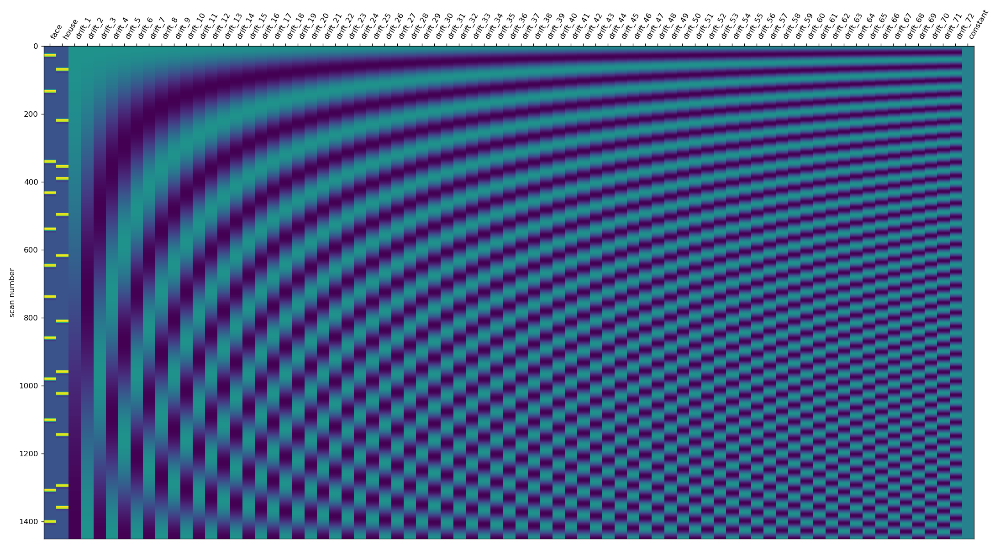
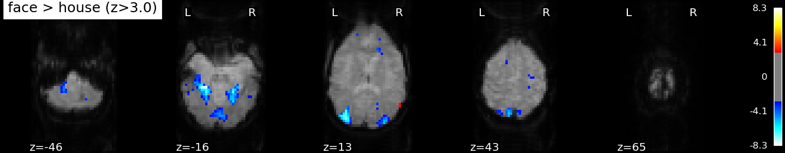

# fMRI-Analysis-Visual-Object-Recognition

## Overview
This project explores how the human brain differentiates between faces and houses, using a block-design fMRI dataset.

## Data  
This project uses the built-in Haxby dataset from Nilearn:  
Haxby, J. V. et al. (2001).  
Distributed and overlapping representations of faces and objects in ventral temporal cortex. Science, 293(5539), 2425–2430.  
Nilearn documentation: https://nilearn.github.io  
- 1452 fMRI timepoints (TR = 2.5s)
- Visual stimuli including faces, houses, and objects
Load data:  
haxby = datasets.fetch_haxby(subjects=[1])  
func_img = haxby.func[0]  
labels = pd.read_csv(haxby.session_target[0], sep=" ")  

## Methods
The script demonstrates three core neuroimaging methods:
1. Preprocessing
  - Brain masking
  - Spatial smoothing
  - Temporal filtering and standardization
2. GLM Analysis
  - Constructing an events table from stimulus labels
  - Fitting a first-level GLM
  - Computing and visualizing the face > house contrast
3. Functional Connectivity
  - Extracting regional time series using the AAL atlas
  - Computing a brain-wide correlation matrix
  - Identifying the most highly correlated regions

## Key Results
- Face > house activation appears in the fusiform gyrus, inferior temporal cortex, and occipital visual areas; these results are consistent with the fusiform face area (FFA).
- The design matrix shows clean alternating blocks for face and house stimuli.
- The connectivity matrix displays strong structure among visual and association regions.
- Top hubs include bilateral calcarine and lingual gyri, hippocampus, cerebellum, and medial frontal cortex.

## Figures
Below are the main outputs produced by the script:

### **GLM Design Matrix**

This design matrix shows the modeled predictors used in the GLM. The alternating blocks of face and house conditions produce distinct regressors matched to the experimental timing, allowing estimation of category-selective brain responses.

### **Face > House Contrast Map**

Statistical map showing brain regions more active during face viewing than house viewing. Strong activation appears in bilateral fusiform gyrus, inferior temporal cortex, and occipital visual areas, which are consistent with the known fusiform face area (FFA).

### **Functional Connectivity Matrix**

A 116×116 correlation matrix (AAL atlas) showing synchronous activity between brain regions. Block structure reflects coordinated responses among visual, cerebellar, and association networks during visual stimulation.

## To Run
Requirements:
- Python 3.8+
- nilearn, numpy, scipy, pandas, matplotlib, seaborn
- pip install nilearn numpy scipy pandas matplotlib seaborn  
Script: python "fMRI Face vs House Recognition.py"
